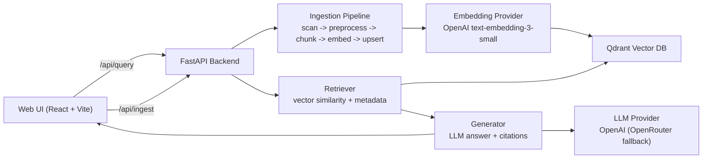
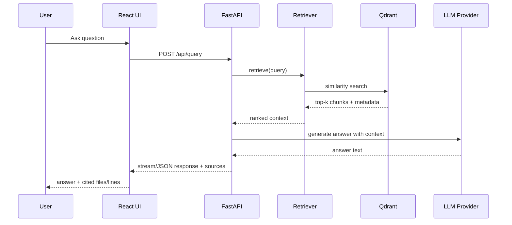

# LegacyLens

> RAG-powered system for navigating large legacy enterprise codebases through natural language.

**Live App:** [https://legacylens-production-9547.up.railway.app/](https://legacylens-production-9547.up.railway.app/)

LegacyLens is a retrieval-augmented code intelligence system for legacy codebases.
It ingests large repos (currently GnuCOBOL), chunks and embeds source files, stores vectors in Qdrant, and answers natural-language questions with cited code locations.

## Why This Exists

Legacy enterprise systems are usually hard to onboard, hard to search semantically, and expensive to hand over across teams. LegacyLens is designed to make legacy code exploration fast, explainable, and deployable with minimal infrastructure.

## What `REINDEX` Does

The **REINDEX** button in the UI triggers:

1. `POST /api/ingest` with `{"reingest": true}`
2. Background ingestion pipeline starts (non-blocking API)
3. Existing Qdrant collection is dropped and recreated
4. Codebase is scanned and preprocessed
5. Files are chunked by language-aware + fallback chunking
6. Chunks are embedded via OpenAI embeddings
7. New vectors + metadata are upserted into Qdrant

Net effect: full rebuild of the searchable vector index from source-of-truth code.

## System Architecture



## Request Lifecycle



## Architecture Decisions (and Why)

1. **FastAPI backend (Python):** best ecosystem for RAG, async IO, and production APIs.
2. **React frontend:** fast iteration for demo UX and straightforward deployment as static assets.
3. **Qdrant for vectors:** strong filtering + metadata support and cloud-hosted portability.
4. **Background ingestion:** avoids request timeouts during long index builds.
5. **Degraded startup mode:** app can boot even when vector DB is temporarily unavailable.
6. **Provider abstraction:** OpenAI primary with OpenRouter fallback to reduce provider lock-in.

## Portability and Deployment Model

- **Local:** Docker Compose (`./start.sh`) for one-command startup.
- **Cloud:** Railway via Docker image and env-driven config.
- **Vector DB:** swap local Qdrant container or managed cloud endpoint by env vars only.
- **Model provider:** switch behavior via environment without changing endpoint contracts.

This keeps the same core architecture runnable across laptop dev, hackathon demo, and public cloud.

## Languages and Stack Used

- **Python**: backend APIs, ingestion pipeline, retrieval/generation orchestration
- **JavaScript (React)**: frontend UI and interactions
- **CSS**: custom desktop/terminal interface styling
- **Docker**: portable runtime packaging
- **Qdrant**: vector indexing and retrieval

## API Endpoints

- `GET /api/health` - service + vector DB status
- `GET /api/stats` - collection statistics
- `POST /api/ingest` - start ingestion/reindex
- `GET /api/ingest/status` - ingestion progress + last stats
- `POST /api/query` - RAG query (streaming or non-streaming)

## Local Run

```bash
git clone https://github.com/s85191939/LegacyLens.git
cd LegacyLens
git clone --depth 1 https://github.com/OCamlPro/gnucobol.git codebase/gnucobol
cp .env.example .env
# set OPENAI_API_KEY in .env
./start.sh
```

Open:

- UI: `http://localhost:8000`
- Health: `http://localhost:8000/api/health`

## Project Evolution (Developer History)

LegacyLens has evolved through fast MVP iterations:

1. Core RAG skeleton (scan/chunk/embed/retrieve/generate)
2. Qdrant-backed vector search with source citations
3. Public deployment hardening for Railway startup behavior
4. Retro desktop-style UI with operational controls (`REINDEX`, status)
5. Test coverage for config/health/vector integration paths

The current architecture reflects a practical tradeoff: fast iteration speed now, with clean seams (vector store + model provider + deployment) for future scale.

## MVP Status (Current)

**Meets MVP for a pre-production RAG explorer:**

- Ingests a real legacy codebase
- Supports natural-language question answering
- Returns cited source context
- Exposes web UI + API surface
- Runs locally and on public cloud endpoint

Remaining work is scale/reliability polish, not missing core MVP capability.
