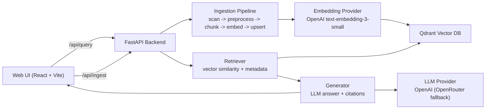
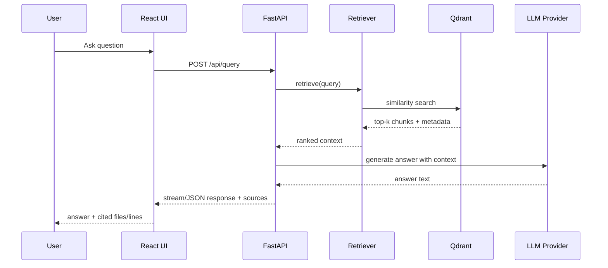

# LegacyLens

> RAG-powered system for navigating large legacy enterprise codebases through natural language.

**Live App:** [https://legacylens-production-9547.up.railway.app/](https://legacylens-production-9547.up.railway.app/)

LegacyLens is a retrieval-augmented code intelligence system for legacy codebases.
It ingests large repos (currently GnuCOBOL), chunks and embeds source files, stores vectors in Qdrant, and answers natural-language questions with cited code locations.

## Why This Exists

Legacy enterprise systems are usually hard to onboard, hard to search semantically, and expensive to hand over across teams. LegacyLens is designed to make legacy code exploration fast, explainable, and deployable with minimal infrastructure.

## What `REINDEX` Does

The **REINDEX** button in the UI triggers:

1. `POST /api/ingest` with `{"reingest": true}`
2. Background ingestion pipeline starts (non-blocking API)
3. Existing Qdrant collection is dropped and recreated
4. Codebase is scanned and preprocessed
5. Files are chunked by language-aware + fallback chunking
6. Chunks are embedded via OpenAI embeddings
7. New vectors + metadata are upserted into Qdrant

Net effect: full rebuild of the searchable vector index from source-of-truth code.

## System Architecture



## Request Lifecycle



## Architecture Decisions (and Why)

1. **FastAPI backend (Python):** best ecosystem for RAG, async IO, and production APIs.
2. **React frontend:** fast iteration for demo UX and straightforward deployment as static assets.
3. **Qdrant for vectors:** strong filtering + metadata support and cloud-hosted portability.
4. **Background ingestion:** avoids request timeouts during long index builds.
5. **Degraded startup mode:** app can boot even when vector DB is temporarily unavailable.
6. **Provider abstraction:** OpenAI primary with OpenRouter fallback to reduce provider lock-in.

## Portability and Deployment Model

- **Local:** Docker Compose (`./start.sh`) for one-command startup.
- **Cloud:** Railway via Docker image and env-driven config.
- **Vector DB:** swap local Qdrant container or managed cloud endpoint by env vars only.
- **Model provider:** switch behavior via environment without changing endpoint contracts.

This keeps the same core architecture runnable across laptop dev, hackathon demo, and public cloud.

## Languages and Stack Used

- **Python**: backend APIs, ingestion pipeline, retrieval/generation orchestration
- **JavaScript (React)**: frontend UI and interactions
- **CSS**: custom desktop/terminal interface styling
- **Docker**: portable runtime packaging
- **Qdrant**: vector indexing and retrieval

### What is Tiktoken?

**Tiktoken** is OpenAI’s tokenizer library. We use it in the ingestion pipeline to **count tokens** in text so chunk sizes stay within model limits.

- **Why it matters:** Embedding and LLM APIs charge and limit by tokens, not characters. Chunks must fit the embedding model’s context; we also cap context sent to the LLM. Guessing by character count is unreliable (e.g. code and symbols tokenize differently).
- **How we use it:** In `backend/ingestion/chunker.py` we use the **`cl100k_base`** encoding (same as GPT-4 and `text-embedding-3-small`). We call `count_tokens(text)` to:
  - Enforce max chunk size in the **fallback** chunker (when we’re not splitting by COBOL paragraph or C function).
  - Record `tokens` per chunk in metadata for cost/debugging.
- **Without tiktoken:** We’d have to approximate with character/word counts or another tokenizer, risking overflow or inconsistent behavior across OpenAI models.

So tiktoken is the **token-counting** dependency that keeps chunking and context windows aligned with the models we call.

### What if we add LangChain and OpenRouter?

- **OpenRouter** is **already** in the project: it’s used as a **fallback** when the primary OpenAI call fails (see `backend/rag/generator.py` and `backend/config.py`). You can set `OPENROUTER_API_KEY`, `OPENROUTER_BASE_URL`, and `OPENROUTER_MODEL` to use OpenRouter-backed models. No code change required to “add” OpenRouter for fallback.

- **Adding LangChain** would be an architectural choice with tradeoffs:

  **Potential benefits:**

  - **Pre-built components:** Document loaders, text splitters, vector-store integrations (including Qdrant), and chain patterns could replace some custom code.
  - **Ecosystem:** Easier to plug in LangSmith, other retrievers, or agent patterns later.
  - **Less custom glue:** Retriever → context formatting → LLM could be expressed as a chain.

  **Tradeoffs:**

  - **Fit to code:** Our chunking is **syntax-aware** (COBOL divisions/paragraphs, C functions). LangChain’s splitters are mostly generic (by character/ token or markdown). We’d either keep a custom splitter and feed LangChain “documents” we built, or lose the current code-aware boundaries.
  - **Citations:** We need **file path + start/end line** on every chunk and in the final answer. LangChain’s default document format and citation flow would need to be extended or wrapped to preserve that.
  - **Dependencies and complexity:** Adding `langchain`, `langchain-openai`, `langchain-qdrant`, etc. increases surface area and upgrade churn. Our current pipeline is a few focused modules with no chain abstraction.
  - **Control:** We explicitly control prompt shape, context assembly, and streaming. LangChain would add a layer between our FastAPI routes and the LLM/embedding calls.

  **Summary:** OpenRouter is already supported as a fallback. Adding LangChain is optional: it could simplify some orchestration and make future integrations easier, but we’d likely keep **custom chunking** (and possibly custom retrieval) to preserve code structure and citations. A hybrid—e.g. LangChain for retrieval + generation, our code for scanning/chunking and metadata—is possible if we want to try the framework without giving up the current code-centric behavior.

## API Endpoints

- `GET /api/health` - service + vector DB status
- `GET /api/stats` - collection statistics
- `POST /api/ingest` - start ingestion/reindex
- `GET /api/ingest/status` - ingestion progress + last stats
- `POST /api/query` - RAG query (streaming or non-streaming)

## Local Run

```bash
git clone https://github.com/s85191939/LegacyLens.git
cd LegacyLens
git clone --depth 1 https://github.com/OCamlPro/gnucobol.git codebase/gnucobol
cp .env.example .env
# set OPENAI_API_KEY in .env
./start.sh
```

Open:

- UI: `http://localhost:8000`
- Health: `http://localhost:8000/api/health`

## Project Evolution (Developer History)

LegacyLens has evolved through fast MVP iterations:

1. Core RAG skeleton (scan/chunk/embed/retrieve/generate)
2. Qdrant-backed vector search with source citations
3. Public deployment hardening for Railway startup behavior
4. Retro desktop-style UI with operational controls (`REINDEX`, status)
5. Test coverage for config/health/vector integration paths

The current architecture reflects a practical tradeoff: fast iteration speed now, with clean seams (vector store + model provider + deployment) for future scale.

## MVP Status (Current)

**Meets MVP for a pre-production RAG explorer:**

- Ingests a real legacy codebase
- Supports natural-language question answering
- Returns cited source context
- Exposes web UI + API surface
- Runs locally and on public cloud endpoint

Remaining work is scale/reliability polish, not missing core MVP capability.

### MVP discussion

**Things to add:** I searched the repo for LangChain, LangGraph, and LangSmith and found no usage.

**2. What if we add LangChain and OpenRouter?**

**OpenRouter:** Already in the project as a fallback when OpenAI fails (`generator.py`, config). You can set `OPENROUTER_API_KEY` (and related env vars) to use it; no extra “add OpenRouter” step needed.

**Adding LangChain:** Described as an optional architectural choice:

- **Upsides:** Ready-made loaders, splitters, Qdrant integration, chains; easier to add LangSmith or other integrations later.
- **Downsides:** Our chunking is syntax-aware (COBOL/C); LangChain splitters are generic—we’d keep custom chunking or lose that. We need file + line citations; LangChain’s defaults would need to be extended. More dependencies and less direct control over prompts and streaming.
- **Summary:** OpenRouter is already supported. LangChain could be added for orchestration, but we’d likely keep custom chunking (and maybe retrieval) for code structure and citations; a hybrid (LangChain for retriever/LLM, our code for scan/chunk/metadata) is possible.

## Explicit Performance Evaluation (Target Gates)

LegacyLens now includes a dedicated evaluator for the Week 3 performance targets:

- Query latency: `<3s` end-to-end (p95)
- Retrieval precision: `>70%` relevant chunks in top-5
- Codebase coverage: `100%` files indexed
- Ingestion throughput: `10,000+ LOC` in `<5 min`
- Answer accuracy: valid cited file/line references

Run locally against a running instance:

```bash
python3 evals/run_performance_eval.py --api-base http://localhost:8000
```

Run with a fresh full reindex before scoring:

```bash
python3 evals/run_performance_eval.py --api-base http://localhost:8000 --reingest
```

Artifacts:

- Query set: `evals/performance_queries.json`
- Output report: `evals/performance_report.json`

The evaluator exits with non-zero status if any gate fails.
